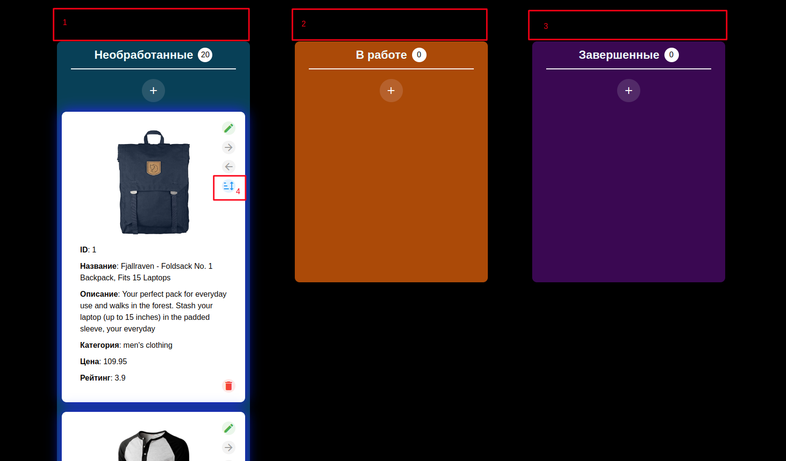

# тестовое задание vue3

Дано: канбан-доска с карточками товаров. У товаров есть рейтинг. Есть кнопка сортировки по рейтингу, но она расположена в карточке товара (см скрин, обозначена 4)

Что необходимо сделать?

1. Добавить панель для сортировки по рейтингу над каждым столбцом канбан доски (обозначены 1,2,3)

2. В панель добавить кнопки для сортировки по рейтингу: по возрастанию рейтинга, по убыванию, без сортировки

3. Задеплоить на vercel.app (github.io или другой хостинг), ссылку отправить по вакансии

------------------------------------------

# Canban System

https://ev-climb.github.io/canban/

## Описание проекта

Простая система управления задачами. Сделана в качестве тестового задания.\

## Stack:
- Vue 3
- Vite
- Vuetify
- Axios
- SCSS
